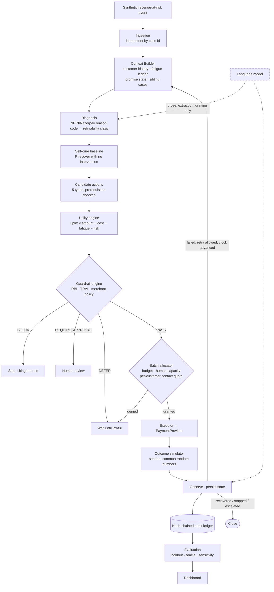

# RecoveryOS

**An agentic revenue-recovery decision engine that measures what it *caused*, not what it collected.**


> Every recovery tool reports the money that arrived after it acted. A large share of that money
> was arriving anyway. RecoveryOS prices every intervention against doing nothing, refuses to act
> when the answer is no, treats a customer's attention as a scarce shared resource, and blocks
> itself with rules it can cite from the RBI and TRAI.

---

## The problem

A merchant does not lose revenue because a payment failed. They lose revenue because their
recovery system cannot tell the difference between:

- a payment that will recover on its own,
- a payment that will recover **if touched correctly**, and
- a payment that will never recover no matter how many times you touch it —

and so it touches all three the same way.

Involuntary churn — revenue lost to failed payments rather than cancellations — runs at roughly
20–40% of total subscription churn, and the average subscription business loses about 9% of MRR
to failed payments. Median dunning recovers around half of failed charges; best-in-class stacks
reach 70–85%, and only by combining retries, messaging and instrument updates. No single lever
gets there.

### Why current approaches are insufficient

Existing recovery automation optimises **coverage**: touch every failure, as often as allowed,
and count everything that lands afterwards as a win. That produces three costs the merchant pays
but never sees on a dashboard.

1. **Wasted spend** on customers who would have paid anyway. Collections literature calls these
   *self-cures*. A system that emails everybody and claims credit for every subsequent payment is
   billing the merchant for work it did not do.
2. **Destroyed goodwill.** Response rates fall and opt-outs rise with contact frequency. The
   customer with a failed subscription *and* an overdue invoice is one human with one inbox, but
   per-case systems give each case its own quota.
3. **Unbounded, unauditable autonomy** — which is precisely why a merchant will not let an agent
   near their customer list.

Razorpay shipped Agent Studio in March 2026 with a prebuilt Subscription Recovery agent. Building
another retry-and-nudge bot is rebuilding a product that already exists. What the Agent Studio
material conspicuously does not discuss — and what commentary at launch raised as the open
question — is guardrails, approval workflows, audit trails, and how a merchant bounds an agent's
autonomy. That gap is what this project is about.

---

## What RecoveryOS does

It is a **decision layer**, not a dunning channel. Seven questions per case:

`What happened?` → `Why?` → `Would this recover on its own?` → `Which intervention adds the most
value?` → `Is it allowed?` → `What happened after?` → `Continue or stop?`

### The core identity

```
utility(action) = expected incremental recovery
                − direct cost
                − customer-fatigue price
                − risk

utility(NO_ACTION) = 0,  exactly, by construction
```

Because doing nothing scores exactly zero, **every intervention has to beat leaving the customer
alone**. "The smartest recovery action is sometimes no action" is not a slogan bolted on top — it
is a consequence of the arithmetic, and `test_decisions.py` asserts it.

Expected incremental recovery is modelled as uplift over a **self-cure baseline**:

```
p_treated = p_self_cure + (1 − p_self_cure) × lift(action)
uplift    = p_treated − p_self_cure
```

which gives the property we want for free: as a customer's chance of paying unaided rises, the
value of chasing them falls towards zero.

---

## Results

Four policies, one identical book of 150 synthetic cases, identical customer behaviour (the
simulator uses common random numbers), seed 42.

| | NAIVE | RULEBOOK | RULEBOOK+RULES | **RECOVERYOS** |
|---|---:|---:|---:|---:|
| Gross recovered | ₹2,00,541 | ₹4,18,059 | ₹3,76,634 | **₹4,25,036** |
| Would have arrived untouched | ₹1,03,702 | ₹1,03,702 | ₹1,03,702 | ₹1,03,702 |
| **Incremental recovered** | ₹58,932 | ₹2,76,450 | ₹2,35,025 | **₹2,83,427** |
| Capture rate vs lawful oracle | 17.6% | 36.6% | 33.0% | **37.2%** |
| Customer contacts sent | 132 | 304 | 112 | **100** |
| Chased customers who would have paid | 25 | 25 | 20 | **9** |
| Guardrail violations | 405 | 175 | 0 | **0** |
| Customers driven to opt out | 11 | 19 | 0 | **0** |
| Incremental per contact | ₹446 | ₹909 | ₹2,098 | **₹2,834** |

Across seven independent seeds (median, range in brackets):

| Policy | Incremental | Contacts | Violations | Opt-outs |
|---|---:|---:|---:|---:|
| NAIVE | ₹67,482 [₹58,932 – ₹1,89,487] | 155 | 402 | 11 |
| RULEBOOK | ₹2,22,466 [₹1,21,471 – ₹4,19,388] | 325 | 195 | 19 |
| RULEBOOK+RULES | ₹1,84,302 [₹99,921 – ₹2,59,767] | 112 | 0 | 0 |
| **RECOVERYOS** | **₹5,23,495 [₹2,83,427 – ₹7,58,022]** | **97** | **0** | **0** |

**Read that as:** against the same dunning ladder run fully compliant, RecoveryOS recovers
about **2.8× the incremental revenue from 13% fewer messages**, with no guardrail violations and
nobody driven to unsubscribe. The seed-42 column above is RecoveryOS's *worst* of the seven
seeds — it is shown as the headline rather than the median precisely because cherry-picking a
seed is the easiest way to lie with a simulation.

`RULEBOOK+RULES` exists to make the comparison fair. Plain `RULEBOOK` sometimes out-earns
RecoveryOS, but it buys the difference with 195 regulatory violations and 19 lost customers —
so it is shown, and so is what it cost.

> **These are controlled-simulation results on fabricated cases.** They describe a reproducible
> model environment, not real merchants, customers, payments or recovered revenue, and support no
> causal claim about the real world. See [Limitations](#limitations).

---

## Architecture



The language model sits **beside** the pipeline, never inside the money path. `engine/` and
`policy/` do not import `llm/` at all.

### The agent loop

```
LOAD_CASE  →  DIAGNOSE  →  SCORE_ACTIONS  →  CHECK_GUARDRAILS  →  EXECUTE  →  OBSERVE
    ↑                                                                            │
    └──────────────── failed, retry allowed, clock advanced ─────────────────────┘
```

Implemented as a LangGraph `StateGraph` over six pure node functions, with an identical
twenty-line fallback driver if LangGraph is unavailable. `test_agent.py` asserts both paths
produce byte-identical decisions, so the graph cannot quietly drift from the code that runs.

### Repository layout

```
backend/recoveryos/
  schemas.py        typed domain model; money is integer paise everywhere
  synthetic.py      18 named archetypes + weighted variations
  expectations.py   the decision each archetype requires — the spec, in code
  bootstrap.py      build a reproducible world from a seed
  db.py             SQLite persistence (stdlib sqlite3)
  engine/           estimators · scoring · allocator · promise parser
  policy/           guardrails.py · rules.py · merchant_policy.json
  agent/            nodes.py (the loop) · graph.py (LangGraph) · runner.py (sweeps)
  simulator/        truth.py (the answer key) · provider.py (the PSP seam)
  audit/            ledger.py — append-only, hash-chained
  evaluation/       policies · metrics · oracle · harness
  llm/              client.py — optional, cached, powerless
  api/              FastAPI
  demo.py           seven hero scenarios
backend/tests/      136 tests
frontend/           Next.js dashboard
scripts/            generate_synthetic_data.py · run_evaluation.py · demo.py
```

---

## What makes it different

Stated honestly, in three columns.

### Already common — implemented, not claimed as novel
Failure-reason classification · smart/scheduled retries · dunning sequences · payment links ·
card-updater flows · escalation thresholds · retry caps. All of this exists in Razorpay, Stripe,
Recurly, Chargebee and Gravy.

### Established in research, rare in shipped recovery products
| Idea | Where it comes from | How it appears here |
|---|---|---|
| Self-cure baseline, incremental uplift | Collections and uplift-modelling literature | Every action scored against a do-nothing counterfactual; `NO_ACTION` scores exactly 0 |
| Randomised holdout | Standard RCT practice | A silent control arm (20%) that no policy is allowed to touch |
| Convex contact-fatigue pricing | Marketing/collections fatigue research | Attention priced in ₹, rising with the square of recent contacts, **pooled per customer** |
| Budget-constrained allocation | Fractional knapsack | Greedy by utility density under a spend budget, human capacity and contact quota |

### Genuinely differentiating at the product level

**1. The counterfactual ledger.** The headline is incremental, not gross, and the amount that
would have arrived anyway is shown as its own line — the number that makes the headline smaller.

**2. Two counterfactuals, side by side.** The exact one (knowable only in simulation, from the
latent self-cure draw) and the holdout estimate (what a real deployment could measure, with a
bootstrap interval). Showing both is how you demonstrate the estimator works — and where it is
too noisy to trust.

**3. Guardrails that cite the regulation.** Every block carries a rule id and a source:
`RBI-EM-2026-PDN-24H`, `RBI-EM-2026-AFA-CEILING`, `TRAI-TCCCPR-QUIET-HOURS`, `TRAI-DLT-CONSENT`.
A payment chase is commercial communication, not a transactional alert, so the daytime window
applies to it — getting that distinction wrong is a real compliance failure in real stacks.

**4. Contact arbitration across competing cases.** Two live cases, one customer, one lawful
contact slot left this week. The allocator auctions the slot to the higher-value case and records
why the other was suppressed. A per-case system cannot see the conflict at all; it sends both.

**5. Tamper-evident audit.** Every decision — including the decisions to do nothing, and the ones
a guardrail refused — is hash-chained to its predecessor. `GET /api/audit/verify` re-derives the
whole chain and says exactly where it broke.

**6. The model cannot choose an action, and that is tested.** `test_llm_is_not_load_bearing.py`
runs the entire book twice — once with no model, once with a model that throws exceptions, emits
prompt injection, and returns confidently wrong data — and asserts that every decision, every
guardrail verdict and every rupee is identical. Only the prose differs.

---

## Decision engine

**Diagnosis** maps real reason codes to a retryability class. This is deterministic and never
model-decided.

| Reason (real Razorpay/NPCI codes) | Class | Consequence |
|---|---|---|
| `insufficient_funds` (Z9), `payment_declined` | TRANSIENT_LIQUIDITY | Time the retry; salary-cycle aware |
| `bank_technical_error`, `gateway_technical_error`, `payment_timed_out`, `payment_collect_request_expired` (U69) | TRANSIENT_TECHNICAL | Short retry, no customer contact |
| `card_expired`, `invalid_vpa`, `vpa_resolution_failed` | INSTRUMENT_INVALID | **Retry is refused** — it cannot clear and still costs a gateway fee |
| `mandate_revoked`, `mandate_paused` | MANDATE_INVALID | Debiting would be unauthorised |
| `afa_required`, `pre_debit_notice_missing` | COMPLIANCE_BLOCKED | Not unwise — not lawful yet |

**Retry timing carries most of the signal in retries.** Insufficient funds is a liquidity
*timing* problem, which in India is sharpened by salary credits clustering in the first week of
the month. A retry landing on day 27 and the same retry landing on day 2 are different decisions,
and the engine reads that from an observable customer flag (`pays_after_payday`), not from the
answer key.

**Observable features only.** The estimator sees payment history, prior self-cures, prior
responses by action type, contact counts, promise state, days overdue, instrument type and the
failure code. It never sees the simulator's response model — `test_audit_and_isolation.py`
enforces that with a static import scan over every module in `engine/` and `policy/`.

All scores are labelled **heuristic** in the UI and in the code. They are documented priors
grounded in published recovery benchmarks, not learned parameters, and nothing here claims
otherwise.

---

## Guardrails

An independent, deterministic layer. It never calls a language model and never consults a
probability. **The agent proposes; this disposes.**

| Rule | Source |
|---|---|
| `RBI-EM-2026-PDN-24H` | RBI Digital Payments E-Mandate Framework, 2026 — mandatory 24-hour pre-debit notification |
| `RBI-EM-2026-AFA-CEILING` | Same framework — ₹15,000 AFA ceiling, ₹1,00,000 for insurance / mutual funds / credit-card bills |
| `TRAI-TCCCPR-QUIET-HOURS` | TRAI TCCCPR — commercial communication confined to a daytime window |
| `TRAI-DLT-CONSENT`, `CONSUMER-OPT-OUT` | DLT consent registration and the preference registry |
| `MERCHANT-RETRY-CAP`, `MERCHANT-RETRY-GAP`, `MERCHANT-CONTACT-CAP-24H/7D`, `MERCHANT-APPROVAL-THRESHOLD`, `MERCHANT-ALLOWED-ACTIONS` | `merchant_policy.json` |
| `POLICY-INSTRUMENT-INVALID`, `POLICY-COMPLIANCE-BLOCKED`, `POLICY-PROMISE-ACTIVE` | Domain safety |
| `ALLOCATOR-CONTACT-SLOT`, `ALLOCATOR-BUDGET`, `ALLOCATOR-HUMAN-CAPACITY` | Batch-level scarcity |

Verdicts are `PASS`, `BLOCK`, `REQUIRE_APPROVAL` or `DEFER`. **`DEFER` matters**: an action that
is not lawful *yet* is scheduled, not abandoned, and the agent decides whether waiting is worth
more than the best action available now.

**Stopping rules are a first-class feature.** A case that stops always names the rule that
stopped it — and the rule reported is the one that killed the *highest-utility* option, which is
what an operator actually wants to know.

---

## Synthetic data

No real merchant, customer, payment or recovery outcome appears anywhere in this project.

```bash
python scripts/generate_synthetic_data.py --cases 120 --seed 42
```

Deterministic: the same seed builds a byte-identical database on any machine
(`test_the_same_seed_builds_the_same_world`). **18 named archetypes**, each existing to exercise
one specific decision, plus weighted randomised variations:

`NSF_TRANSIENT` · `NSF_SALARY_CYCLE` · `CARD_EXPIRED` · `INVALID_VPA` · `ISSUER_DOWNTIME` ·
`RETRY_CAP_EXHAUSTED` · `SELF_HEALER` · `CONTACT_FATIGUED` · `PROMISE_ACTIVE` · `PROMISE_BROKEN` ·
`HIGH_VALUE_APPROVAL` · `MANDATE_REVOKED` · `RBI_NOTICE_MISSING` · `AFA_CEILING_BREACH` ·
`CART_ABANDONED_HOT` · `OPTED_OUT` · `ARBITRATION_MINOR` + `ARBITRATION_MAJOR`

Each archetype carries a **hidden ground-truth response profile** — self-cure probability, a
retry curve, per-channel response rates, fatigue sensitivity — stored in a physically separate
`truths` table that only simulator code may read. The engine sees observable fields only.

`expectations.py` declares the decision each archetype requires and the decisions it forbids, and
the test suite asserts against it. **The scenario library is the specification.**

---

## Evaluation methodology

Four policies through identical machinery — same context, same candidates, same scoring, same
guardrail evaluation, same simulator, same random draws. Only the *choice* differs, and whether
the guardrail verdicts are honoured. If the baselines used different plumbing, any difference in
the results could be plumbing.

- **NAIVE** — chase every failure with the first thing that might work. No economics, no fatigue,
  no compliance. Recovery automation as a for-loop.
- **RULEBOOK** — the standard dunning ladder. Honours operational caps only.
- **RULEBOOK+RULES** — the same ladder, fully compliant. The fair like-for-like comparison.
- **RECOVERYOS** — everything.

Measured: incremental (exact and holdout-estimated, with a bootstrap interval), capture rate
against a lawful oracle, interventions, contacts, escalations, spend, interventions on
self-curers, guardrail violations, opt-outs, actions per case, and stop reasons.

**The oracle** replays every case under every lawful action with the same random draws and
perfect foresight, taking the same budget of attempts a real policy gets. It is not achievable
by any system — it is a denominator, not a target.

```bash
python scripts/run_evaluation.py --cases 150 --seed 42
python scripts/run_evaluation.py --cases 150 --sweep 42,43,44,45,46,47,48
```

---

## Demo scenarios

```bash
python scripts/demo.py            # list them
python scripts/demo.py arbitration
python scripts/demo.py --all
```

Nothing is scripted; each runs the real engine and prints what actually happened. They are also
runnable from the dashboard's Scenarios page.

| Key | Question it answers |
|---|---|
| `counterfactual` | Every recovery tool reports what it collected. How much would have arrived anyway? |
| `no-action` | Nothing is blocked and the customer is reachable. Why is doing nothing correct? |
| `arbitration` | Two live cases want to message the same person, one slot left. Who gets it? |
| `regulator` | What stops the agent, and where does that rule actually come from? |
| `rogue-llm` | What happens when the language model proposes something forbidden? |
| `full-loop` | Does it close the loop, and does it know when to give up? |
| `promise` | A customer commits to a date. What does the system do until then? |

---

## Running it locally

Requires Python 3.11+ and Node 20+. No Docker, no Redis, no queues, no cloud account, no
Razorpay merchant activation, no API key.

```bash
# 1. Backend
python -m venv .venv
.venv\Scripts\activate            # Windows;  source .venv/bin/activate on macOS/Linux
pip install -r requirements.txt

cp .env.example .env              # optional — everything works with the defaults

python scripts/generate_synthetic_data.py --cases 120 --seed 42
python scripts/run_evaluation.py --cases 150 --seed 42
python -m pytest backend/tests -q

uvicorn recoveryos.api.app:app --app-dir backend --port 8001 --reload

# 2. Frontend, in a second terminal
cd frontend
npm install
npm run dev                       # http://localhost:3000
```

The dashboard's **Rebuild and run a sweep** button regenerates the world and works the whole book
end to end, so a reviewer can see the system run without touching a terminal.

### Environment variables

Every one of these is optional. With `LLM_ENABLED=false` the entire system runs deterministically
and offline.

| Variable | Default | Purpose |
|---|---|---|
| `LLM_ENABLED` | `false` | Turn the language layer on. Changes prose only. |
| `LLM_BASE_URL` | `https://router.huggingface.co/v1` | Any OpenAI-compatible endpoint |
| `LLM_API_KEY` | — | Hugging Face fine-grained token with *Make calls to Inference Providers* |
| `LLM_MODEL` | `openai/gpt-oss-120b:fastest` | Open-weights, fast, cheap |
| `LLM_CACHE_DIR` | `data/llm_cache` | Responses cached by prompt hash |
| `LLM_CACHE_ONLY` | `false` | Serve only from cache — reproducible with no token at all |
| `RECOVERYOS_DB` | `data/recoveryos.db` | SQLite path |
| `RECOVERYOS_SEED` | `42` | Determinism |
| `API_PORT` | `8001` | Backend port |
| `NEXT_PUBLIC_API_BASE` | `http://127.0.0.1:8001` | Where the dashboard looks for the API |

The same three `LLM_*` variables point at Groq, OpenRouter, Together or a local Ollama
(`http://localhost:11434/v1`) with no code change.

---

## The role of the language model

**It may:** restate a diagnosis in plain English · explain a decision that has already been made ·
draft the body of a customer message · pull a date and an amount out of a free-text reply · offer
a non-binding second opinion.

**It may not:** choose an action · compute a number · authorise a payment · override a guardrail ·
decide when to stop.

Every model output is schema-validated with a deterministic fallback. Malformed JSON, prose
wrappers, code fences, out-of-range values and refusals are all handled and counted, never
believed.

**One finding worth reporting.** An earlier version handed promise extraction straight to the
model, and `test_llm_is_not_load_bearing` caught the consequence immediately: a hallucinated date
became a real scheduling decision, parking a customer in `WAITING` until 2099. The fix was
architectural, not a prompt tweak — a deterministic parser runs first, the model is a fallback for
text the parser cannot read, and even then its date is **clamped into a policy window** before it
can schedule anything. That is what the test exists for.

---

## Testing

```bash
python -m pytest backend/tests -q      # 136 tests, ~22s
```

| File | What it proves |
|---|---|
| `test_decisions.py` | Every archetype reaches its required decision and never a forbidden one; the utility identity holds; uplift shrinks as self-cure rises; `NO_ACTION` is always exactly zero |
| `test_guardrails.py` | Retry caps, dead instruments, fatigue pooling across a customer's cases, TRAI quiet hours, RBI pre-debit notice and AFA ceilings, opt-out, live promises, approval thresholds, off-allowlist actions; every verdict cites a registered rule |
| `test_agent.py` | Every case terminates and says why; LangGraph and the plain driver agree exactly; the loop closes and is bounded; terminal means terminal; duplicate ingestion is idempotent; holdout cases are never touched; promise lifecycle |
| `test_audit_and_isolation.py` | **The decision engine cannot import the simulator** (static scan); ground truth lives in its own table; every decision is logged; the chain verifies; tampering and deletion are both detected; same seed → same world, same run |
| `test_allocation_and_evaluation.py` | Contact-slot arbitration; budget and human-capacity limits; the holdout arm is genuinely untouched; no policy exceeds the oracle; metrics arithmetic is internally consistent |
| `test_llm_is_not_load_bearing.py` | A hostile model changes nothing that matters; malformed output is rejected; model-supplied dates are clamped; the deterministic parser runs first |

---

## Limitations

Stated plainly, because the track brief asks for honest metrics three times and this is the
section that answers it.

- **No real merchant data.** Every customer, case, amount, failure and outcome is fabricated.
- **Simulated outcomes.** Whether a retry clears or a customer responds is a seeded draw from a
  hand-authored response model. It is not evidence about real-world recovery.
- **The simulator could flatter us, and this is the biggest risk in the project.** The mitigations:
  the response model was authored from published benchmarks and **frozen before any policy code
  was written**; policies are structurally prevented from reading it (enforced by test); all four
  policies share identical machinery and identical random draws; and results are reported across
  seven seeds with the range shown, with RecoveryOS's *worst* seed as the headline.
- **Heuristic scoring.** The self-cure priors and action lifts are documented judgement calls, not
  learned parameters. They are labelled heuristic everywhere they appear.
- **The holdout estimator is noisy at this sample size.** With 26–30 control cases and heavily
  skewed amounts, the bootstrap interval on the holdout-based incremental is wide, and the
  evaluation says so rather than quoting the point estimate alone.
- **No causal claim.** Nothing here establishes that this approach would produce these results on
  real traffic.
- **No production payment execution.** `MockPaymentProvider` is the only implementation of the
  `PaymentProvider` interface. No real WhatsApp, SMS, email or voice; no customer is contacted.
- **One modelled harm.** Over-contacting can cause an opt-out that forfeits a payment which was
  otherwise arriving. Real over-contact harms are broader than that.
- **Single merchant policy, single currency, single timezone.** Datetimes are naive local time in
  Asia/Kolkata.
- **Regulatory rules are simplified.** They are faithful to the published thresholds and windows,
  and they are not legal advice or a compliance implementation.

---

## Future integration

The `PaymentProvider` interface in `simulator/provider.py` is the seam. A Razorpay implementation
would satisfy `retry_debit`, `deliver_link` and `send_message` against the Subscriptions, Payment
Links and WhatsApp APIs, and nothing else in the system would change — the decision engine,
guardrails, allocator, ledger and evaluation are all provider-agnostic.

Beyond that: per-merchant policy profiles; learned uplift models replacing the heuristic priors
once real outcome data exists (the holdout arm is exactly the apparatus that would generate the
training data); a real DLT template registry; and an approvals queue for the escalation path.

---

## References

- Razorpay Agent Studio — <https://razorpay.com/agent-studio/> and the FTX'26 launch announcement
- Razorpay UPI error codes — <https://razorpay.com/docs/errors/payments/upi/>
- Razorpay on RBI e-mandate regulations — <https://razorpay.com/blog/rbi-e-mandate-regulations/>
- RBI, Digital Payments — E-Mandate Framework, 2026 (issued 21 April 2026)
- TRAI, Telecom Commercial Communications Customer Preference Regulations, and the DLT regime
- Baremetrics, involuntary churn and subscription payment recovery benchmarks
- Devriendt et al., *A unified survey of treatment effect heterogeneity modeling and uplift
  modeling* — <https://arxiv.org/pdf/2007.12769>
- Predictive analytics for debt collection using contact-centre information (ScienceDirect)
- McKinsey, *Behavioral insights and innovative treatments in collections*

---


*Synthetic data. Simulated outcomes. No real merchant, customer or payment appears in this
project, and no real customer was contacted.*
